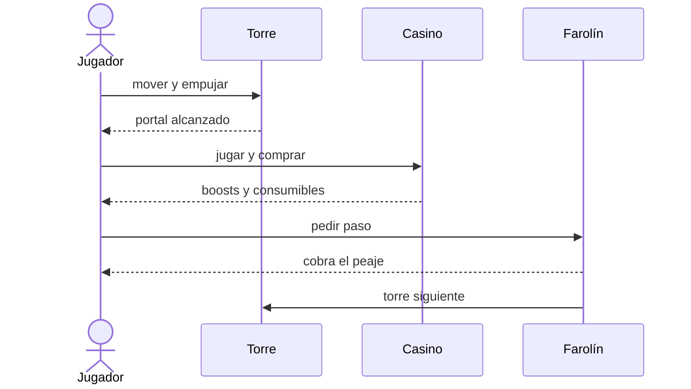

# Una etapa del juego

### Torre, casino y peaje

¿Qué pasa, en orden, desde que empieza una etapa hasta que se pasa a la siguiente?

```mermaid
sequenceDiagram
    actor J as Jugador
    participant T as Torre
    participant C as Casino
    participant F as Farolín
    J->>T: mover y empujar
    T-->>J: portal alcanzado
    J->>C: jugar y comprar
    C-->>J: boosts y consumibles
    J->>F: pedir paso
    F-->>J: cobra el peaje
    F->>T: torre siguiente
```
