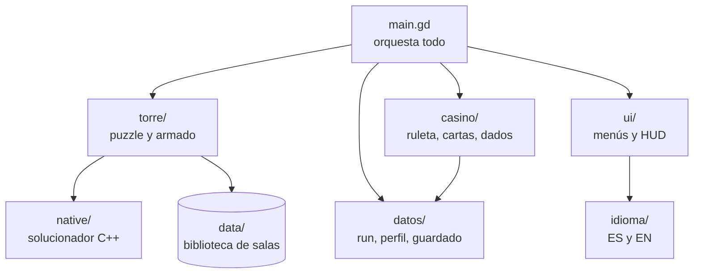

# Módulos del juego

### Dependencias entre módulos

¿Cómo se reparte el juego en módulos y quién usa a quién?

```mermaid
flowchart TB
    M["main.gd<br/>orquesta todo"]
    T["torre/<br/>puzzle y armado"]
    C["casino/<br/>ruleta, cartas, dados"]
    D["datos/<br/>run, perfil, guardado"]
    U["ui/<br/>menús y HUD"]
    L["idioma/<br/>ES y EN"]
    N["native/<br/>solucionador C++"]
    B[("data/<br/>biblioteca de salas")]
    M --> T
    M --> C
    M --> U
    M --> D
    T --> N
    T --> B
    C --> D
    U --> L
```
