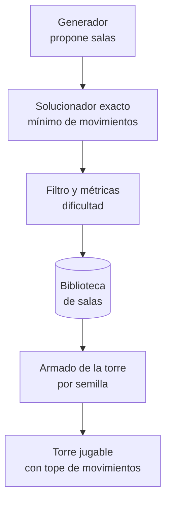

# Salas de la torre

### De la sala generada a la torre jugable

¿Cómo llega una sala desde el generador hasta una torre que se juega?

```mermaid
flowchart TB
    G["Generador<br/>propone salas"]
    S["Solucionador exacto<br/>mínimo de movimientos"]
    F["Filtro y métricas<br/>dificultad"]
    B[("Biblioteca<br/>de salas")]
    A["Armado de la torre<br/>por semilla"]
    J["Torre jugable<br/>con tope de movimientos"]
    G --> S
    S --> F
    F --> B
    B --> A
    A --> J
```
